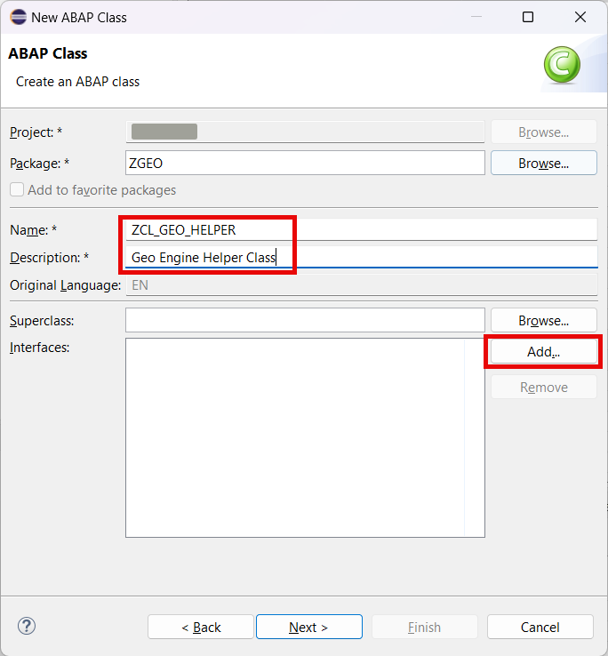
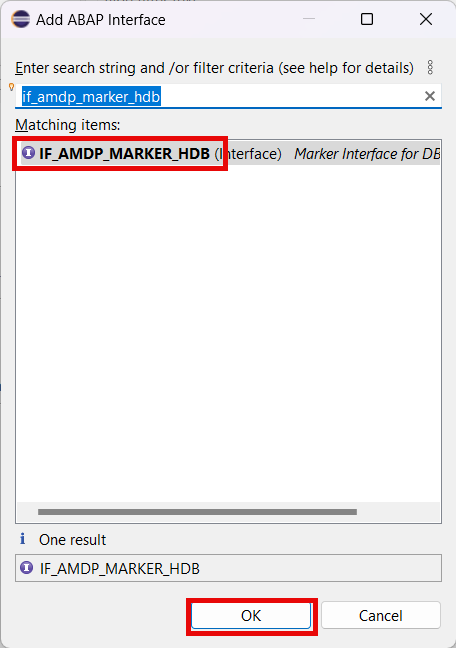

# Add geo coordinates logic

## Introduction 

SAP HANA has significant potential to analyze geographic information. Support for the processing of spatial data represents a key evolution in SAP HANA. To have the most powerful and flexible way to access and manipulate the spatial data, it is necessary to be at the database layer. 

ABAP Managed Database Procedures is one of the recommended patterns for use in ABAP code optimization within the context of ABAP development on SAP HANA. AMDPs allow you as an ABAP developer to write database procedures directly in ABAP. AMDP is implemented in ABAP class methods (so-called AMDP methods) that serve as a container for SQLScript code.

In this chapter we will create a helper class with 2 methods, working at the database layer.

First method **get_geo_point** will convert coordinates to the HANA spatial type **geom_ewkb**. We will use this method later to convert the human readable coordinates to the internal HANA representation. Both type of data will be stored in the database. This will garantee data consistency between those two approaches.

Second method **get_partners_around** will return all the partners within some radius around one point defined by the coordinates. This is a typical geo search task. It will be used later as a RAP function exposed with the OData service.

## Content

### Task 1: Create class for working with the SAP HANA spatial engine

1. Right click on your package name created in the previous exercise.

2. Choose **New** &rarr; **Other ABAP Repository Object** option in the context menu.

   

3. Choose **ABAP Class** in the **Source Code Library** folder and then choose **Next**.

   

4. Enter the following data and then choose **Add** in the **Interfaces** section:

  - **ZCL_GEO_HELPER** in the **Name** field
  - **Geo Engine Helper Class** in the **Description** field

   

5. On the next screen search for **if_amdp_marker_hdb** interface. Select it and choose **OK** button.

  

6. Choose **Next** button.

5. On the next screen select your transport (if applicable) and choose **Finish**.

6. Replace the code of the class with the one below:

~~~abap
CLASS zcl_geo_helper DEFINITION
  PUBLIC
  FINAL
  CREATE PUBLIC .

  PUBLIC SECTION.
    INTERFACES:
      if_amdp_marker_hdb.

    TYPES:
      ty_coord TYPE p LENGTH 16 DECIMALS 13,
      BEGIN OF ty_str,
        point TYPE geom_ewkb,
      END OF ty_str,
      ty_tab TYPE TABLE OF ty_str,

      BEGIN OF ty_coords,
        latitude  TYPE ty_coord,
        longitude TYPE ty_coord,
      END OF ty_coords,
      ty_coords_tab TYPE TABLE OF ty_coords,

      ty_radius TYPE i,

      BEGIN OF ty_partner_distance,
        Partner TYPE ZI_BusinessPartner-Partner,
        Distance TYPE int4,
      END OF ty_partner_distance,
      ty_partner_distance_tab TYPE TABLE OF ty_partner_distance.

    CLASS-METHODS get_geo_point
      IMPORTING
        VALUE(iv_latitude)  TYPE ty_coord
        VALUE(iv_longitude) TYPE ty_coord
      EXPORTING
        VALUE(et_points)    TYPE ty_tab
      RAISING
        cx_amdp_execution_error.

    CLASS-METHODS get_partners_around
      IMPORTING
        VALUE(iv_latitude)  TYPE ty_coord
        VALUE(iv_longitude) TYPE ty_coord
        VALUE(iv_radius) TYPE ty_radius
      EXPORTING
        VALUE(et_partners) TYPE ty_partner_distance_tab
      RAISING
        cx_amdp_execution_error.

  PROTECTED SECTION.
  PRIVATE SECTION.
ENDCLASS.

CLASS ZCL_GEO_HELPER IMPLEMENTATION.

  METHOD get_geo_point
    BY DATABASE PROCEDURE
    FOR HDB
    LANGUAGE SQLSCRIPT
    OPTIONS READ-ONLY.
    et_points = SELECT NEW ST_POINT( iv_longitude, iv_latitude ).ST_SRID( 4326 ) as point FROM DUMMY;
  ENDMETHOD.

  METHOD get_partners_around
    BY DATABASE PROCEDURE
    FOR HDB
    LANGUAGE SQLSCRIPT
    OPTIONS READ-ONLY
    USING zbupageo.

    et_partners = SELECT partner AS Partner,
                          location.ST_Distance( NEW ST_Point(iv_longitude, iv_latitude).ST_SRID( 4326 ) ) as Distance
                   FROM zbupageo
                   WHERE location.ST_Distance( NEW ST_Point(iv_longitude, iv_latitude).ST_SRID( 4326 ) ) <= iv_radius
                   ORDER BY Distance;
  ENDMETHOD.
ENDCLASS.
~~~

7. Choose **Activate** button.
   
  

## Result

You have created a class with ABAP Managed Database Procedures. This class can be now utilized in the service behavior methods.

[Next Tutorial: Create service behavior artifacts](../behavior-definition/README.md)

## Further reading / Reference Links

- [ABAP Managed Database Procedures](https://help.sap.com/docs/abap-cloud/abap-development-tools-user-guide/abap-managed-database-procedures-amdp)
- [SAP HANA Spatial Reference](https://help.sap.com/docs/SAP_HANA_PLATFORM/cbbbfc20871e4559abfd45a78ad58c02/e1c934157bd14021a3b43b5822b2cbe9.html)