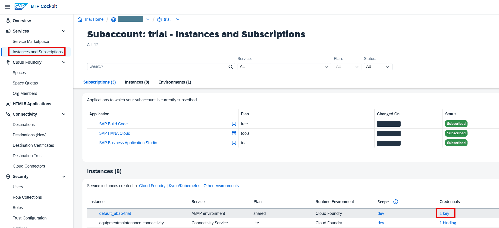
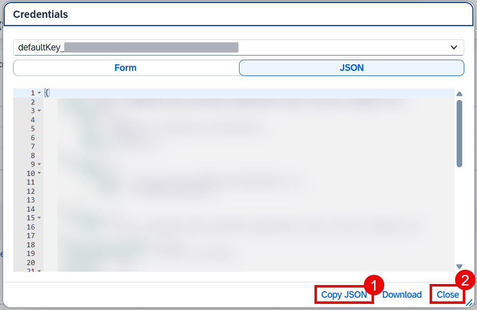
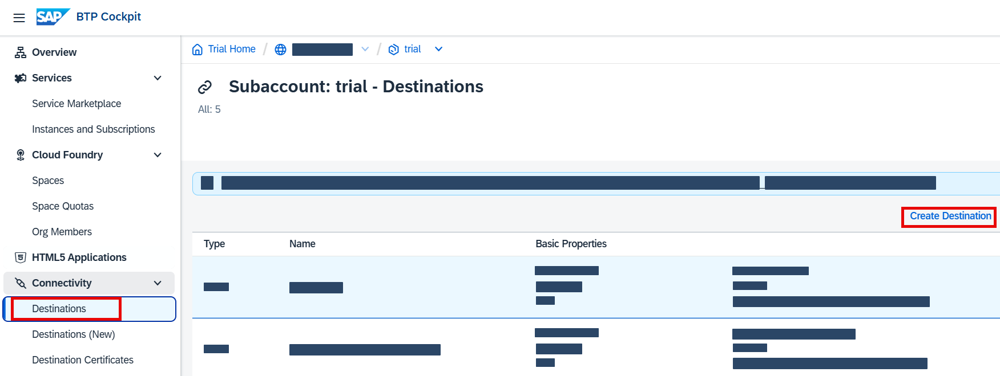
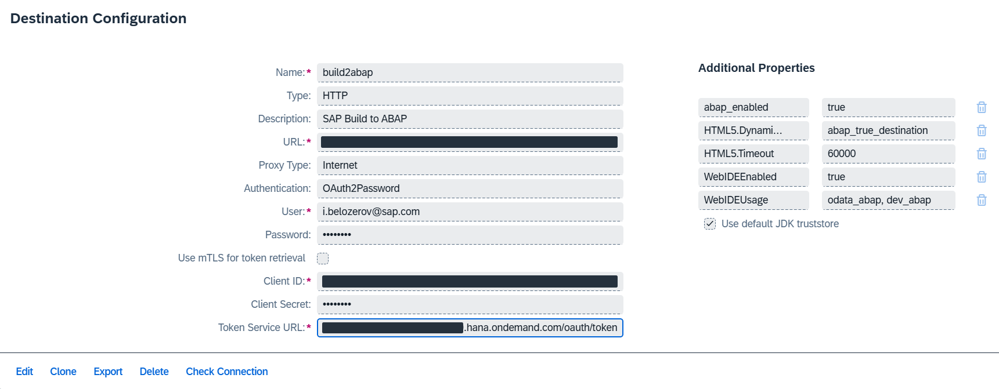

# Introduction

In this part of the mission, you create an API service which will provide the data for the available incident processors. The data includes ID, name and geo location of the processors.

Let's assume that the main information about the incident processors (like ID and name) is coming from an SAP S/4HANA Cloud system (Business Partners data). For simplicity, this data will be uploaded only once. In real productive scenarios there should be some more comprehensive integration. To reproduce this scenario, you don't need an access to a real SAP S/4HANA Cloud system as you will use the SAP Business Accelerator Hub Sandbox.

The geo coordinates for the processors will be assigned randomly. It is assumed that later on there could be some additional application which updates the actual location of a processor.

## 1. Prepare the Landscape

To start this part of the scenario, you need a subaccount in SAP BTP with the SAP BTP, ABAP Environment enabled. You can also use a trial account in SAP BTP. See the [Create an SAP BTP ABAP Environment Trial User](https://developers.sap.com/tutorials/abap-environment-trial-onboarding.html) tutorial.

Alternatively, you can use your own subaccount. Make sure that you have the necessary quotas and subscriptions. See [Getting Started in the ABAP Environment](https://help.sap.com/docs/sap-btp-abap-environment/abap-environment/getting-started-in-abap-environment).

> Make sure that your user has a developer role (`SAP_BR_DEVELOPER`) to access the system via ABAP Development tools. If you used a booster to create the ABAP Environment, then the role was automatically granted. Otherwise see details [here](https://help.sap.com/docs/sap-btp-abap-environment/abap-environment/creation-of-developer-users).

## 2. Prepare SAP Build Environment

After your subaccount is ready, you have to prepare your SAP Build environment to be able to create projects in the ABAP Environment instance. Follow the prerequisites section in [this documentation](https://help.sap.com/docs/build/sap-build-core/create-abap-cloud-project).

For the trial system you don't have an option to manage the communication artifacts and users in ABAP Environment. That's why you will need to create a destination with your credentials (skip all other steps in the documentation above).

  1. On the **Instances and Subscription** choose the service key for the service instance **ABAP Environment**.
  
  

  2. Copy the content of the key to some text editor. You will need it later to create destination. Then choose **Close**.

  

  3. Open **Destinations** tab in your subaccount and then choose **Create Destination**.

  

  4. Fill the following fields:

  | **Parameter**           | **Value**                                                   |
  | ----------------------- | ----------------------------------------------------------- |
  | **Name**                | `build2abap`                                                |
  | **Type**                | `HTTP`                                                      |
  | **Description**         | `SAP Build to ABAP`                                         |
  | **URL**                 | *Use **url** from the service key*                          |
  | **Proxy Type**          | `Internet`                                                  |
  | **Authentication**      | `OAuth2Password`                                            |
  | **User**                | *your BTP Logon User Name*                                  |
  | **Password**            | *your BTP Logon Password*                                   |
  | **Client ID**           | *Use **uaa-clientid** from the service key*                 |
  | **Client Secret**       | *Use **uaa-clientsecret** from the service key*             |
  | **Token Service URL**   | *Use **uaa-url** from the service key. And add **/oauth/token** at the end of the URL* |

  5. Add the following **Additional Properties**:

  | **Property**                  | **Value**                                             |
  | ----------------------------- | ----------------------------------------------------- |
  | **abap_enabled**              | true                                                  |
  | **HTML5.DynamicDestination**  | abap_true_destination                                 |
  | **HTML5.Timeout**             | 60000                                                 |
  | **WebIDEEnabled**             | true                                                  |
  | **WebIDEUsage**               | odata_abap, dev_abap                                  |

  

## Result
 
You have prepared a subaccount in SAP BTP with the SAP BTP, ABAP Environment and prepared a SAP Build environment. Now, you are ready to develop the API.

## Next Step

[Create Project](../package/README.md)

## Reference Links

- [Trial Accounts and Free Tier](https://help.sap.com/docs/btp/sap-business-technology-platform/trial-accounts-and-free-tier)
- [SAP BTP, ABAP Environment](https://help.sap.com/docs/sap-btp-abap-environment)
