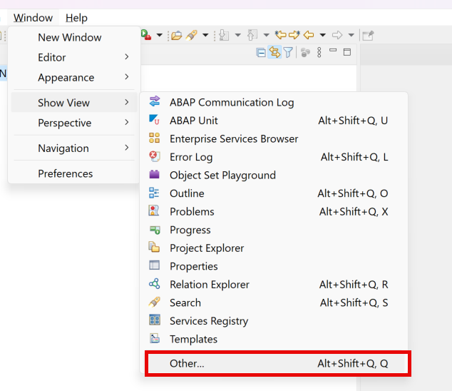
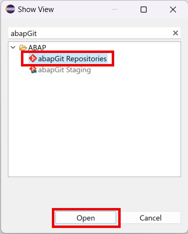
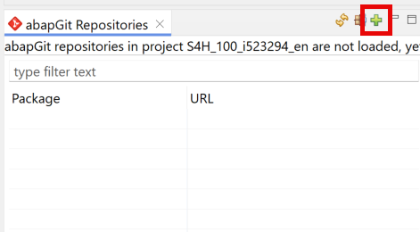
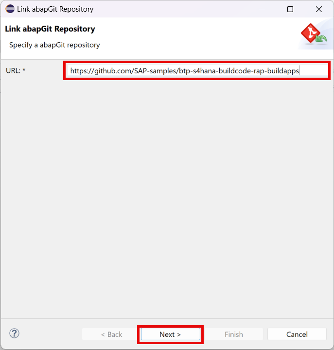
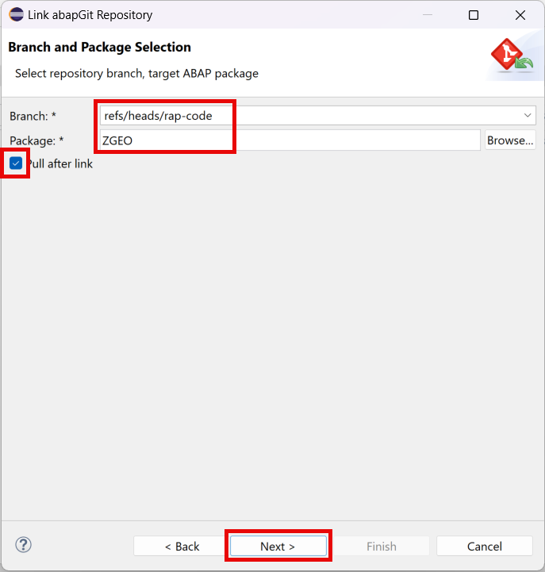
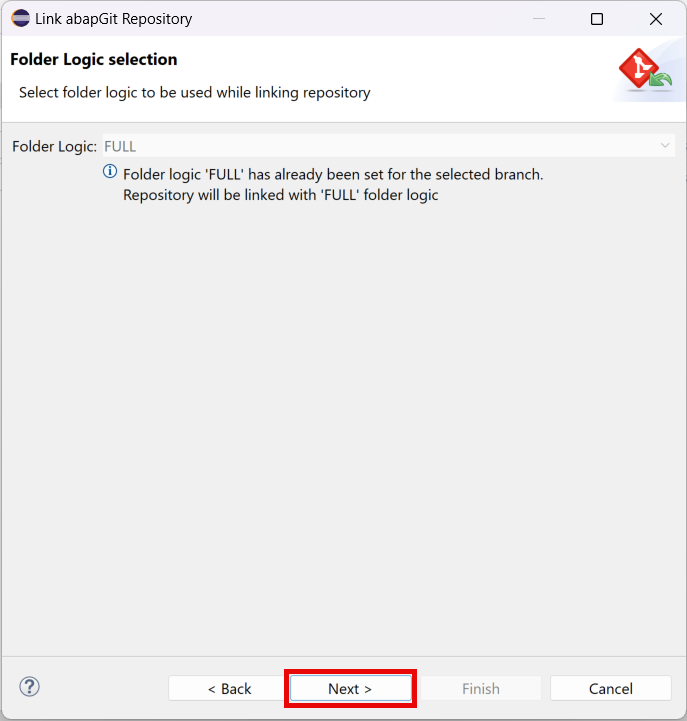

# Create Package

## Introduction

To store and group the development objects for your API, you need to create an ABAP package. Optionally, you can get all the objects from a provided GIT repository and save some time for this tutorial. We recommend that you go through all the steps for a better understanding of the API creation.

## 1. Create Package

To create a package, follow the [Create an ABAP Package](https://developers.sap.com/tutorials/abap-dev-create-package.html) tutorial. Use **ZGEO** as a name of the package and **ZLOCAL** as a superpackage.

## (OPTIONAL) 2. Clone the Repository

If you don't want to create all the objects of this tutorial manually, you can bypass most of the work by cloning the repository which we have provided for you. Unfortunately, you still need to do some steps manually as some of the object types are not supported by **abapGit**.

1. You need to have **abapGit** extension installed in your Eclipse environment. See [abapGit Repositories ADT Plug-In](https://eclipse.abapgit.org/updatesite/).

2. Choose **Window** &rarr; **Show View** &rarr; **Other...** from the Eclipse menu.

  

3. Choose **abapGit Repositories** under the **ABAP** folder and then choose **Open**.

  

4. Choose the Plus button in the **abapGit Repositories** tab to create a new repository.

  

5. Enter the following URL in the **URL** field and then choose **Next**.

~~~
https://github.com/SAP-samples/btp-s4hana-buildcode-rap-buildapps
~~~

  

6. Choose **ref/heads/rap-code** in the **Branch** field and enter **ZGEO** in the **Package** field. Then, choose **Pull after link** checkbox. Then choose **Next**.

  

7. On the next screen, choose **Next**.

  

8. Select your transport (if applicable) and choose **Finish**.

9. The repository will be cloned to your new package. Wait until it's over.

10. As mentioned before, some of the objects cannot be stored in the abapGit repository. So, you need to follow the steps in the **Task 1** and **Task 2** of the chapter [Fill the test data](../fill-data/README.md) before you can activate the development objects.

11. In the line 44 ofthe  **ZCL_FILL_BUPA_TABLES** class, replace **{YOUR_API_KEY}** with the API key that you've got in the previous step.

  

12. Choose **Activate inactive ABAP development objects**. Select all objects in the new window and choose **Activate**.

  

13. Publish the service as described in the **step 6** of the **Task 3** in [this chapter](../service/README.md). 

14. Follow the steps in the **Task 4** of the chapter [Fill the test data](../fill-data/README.md).

15. Now you can test the service as described [here](../test/README.md).

## Result

You have created a package to store all other artifacts. If you used the abapGit approach to get your development objects, you are done with this part of the scenario. Otherwise, follow the next tutorial.

## Next Step

[Create Database Tables](../tables/README.md)

## Reference Links

- [ABAP Packages](https://help.sap.com/docs/ABAP_PLATFORM/c238d694b825421f940829321ffa326a/4ec14bab6e391014adc9fffe4e204223.html)
- [Working with abapGit](https://help.sap.com/docs/btp/sap-business-technology-platform/working-with-abapgit)
