# Create Project

## Introduction

To store and group the development objects for your API, you need to create an ABAP package. Optionally, you can get all the objects from a provided GIT repository and save some time for this tutorial. We recommend that you go through all the steps for a better understanding of the API creation.

## Prerequisites

You have downloaded one of the latest milestones from the [Eclipse Foundation](https://help.sap.com/docs/link-disclaimer?site=https%3A%2F%2Fwww.eclipse.org%2Fdownloads%2Fpackages%2Frelease%2F2024-12) Web site and installed ADT from the customer update site. For more information, see [SAP Development Tools for Eclipse](https://tools.hana.ondemand.com/latest).

## Create Project

  1. At the **Instances and Subscriptions** tab open **SAP Build Code** application to enter the *SAP Build* lobby.

  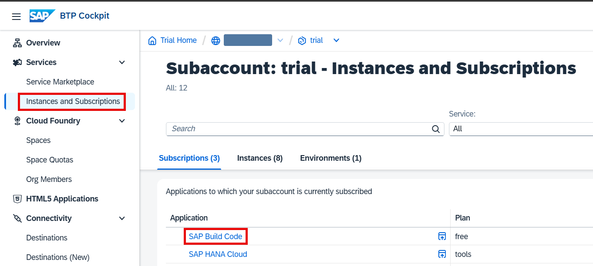

  2. Choose **Create**.

  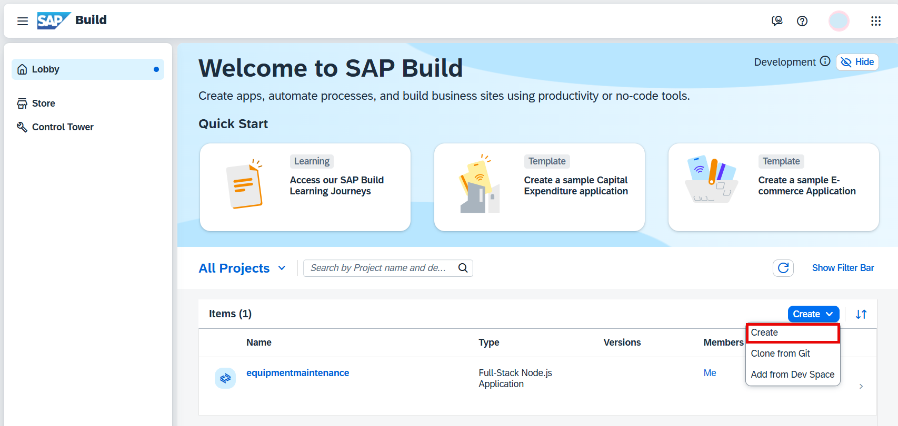

  3. Choose **Application** and then choose **Next**.

  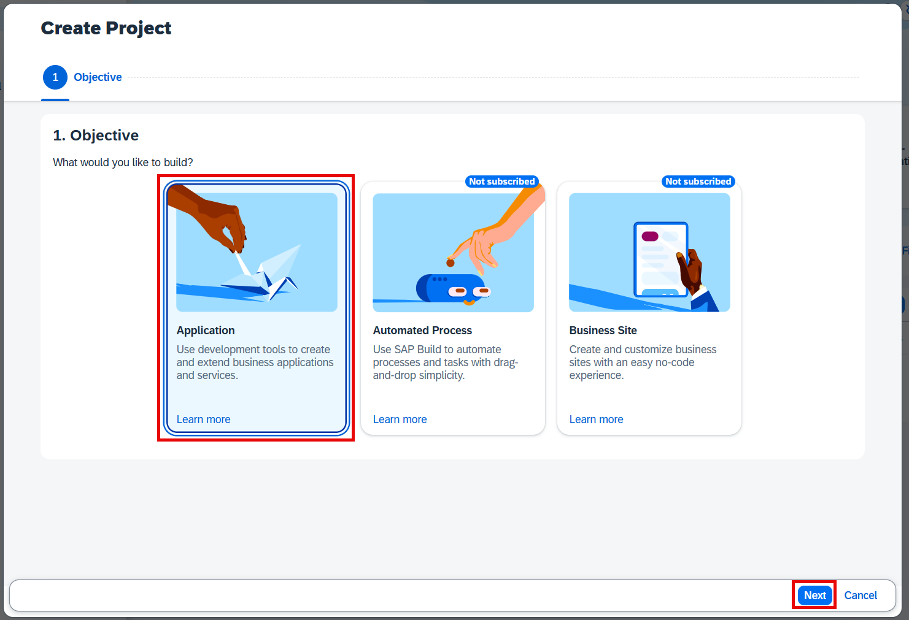

  4. Choose **Full-Stack** and then choose **Next**.

  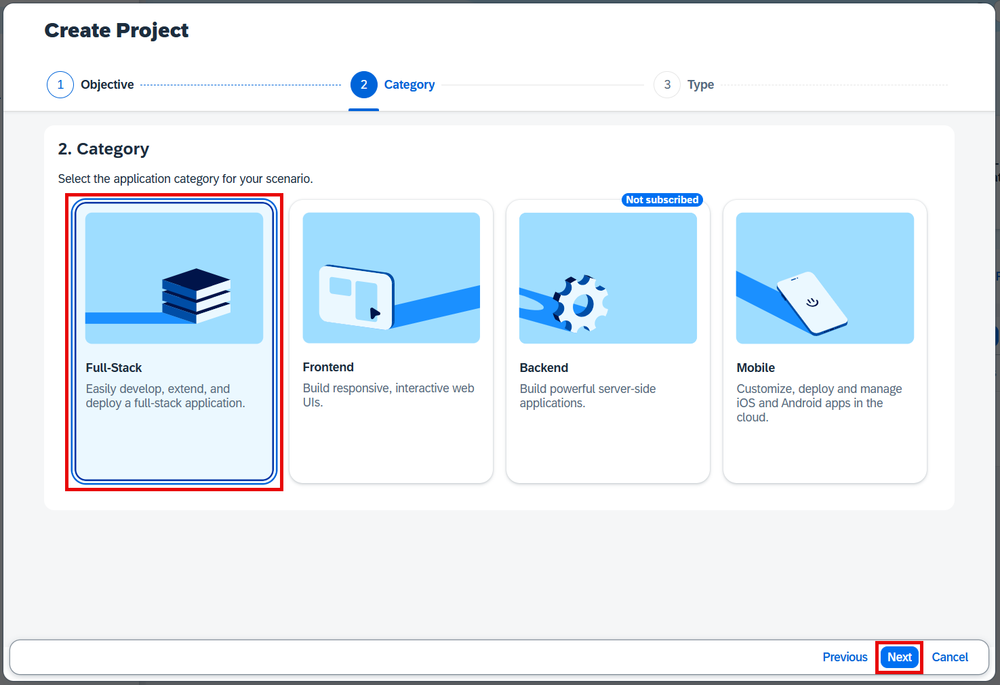

  5. Choose **Full-Stack ABAP** and then choose **Next**.

  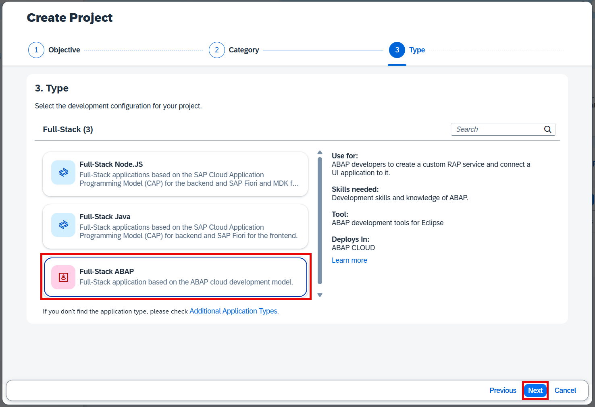

  6. Choose **build2abap** in the dropdown list of the **System** field. For the **Package** subgroup select **New** and enter **ZLOCAL** in the **Superpackage** field, **ZGEO** in the **Package** field and **Location of Business Partners** in the **Description** field. Then choose **Next**.

  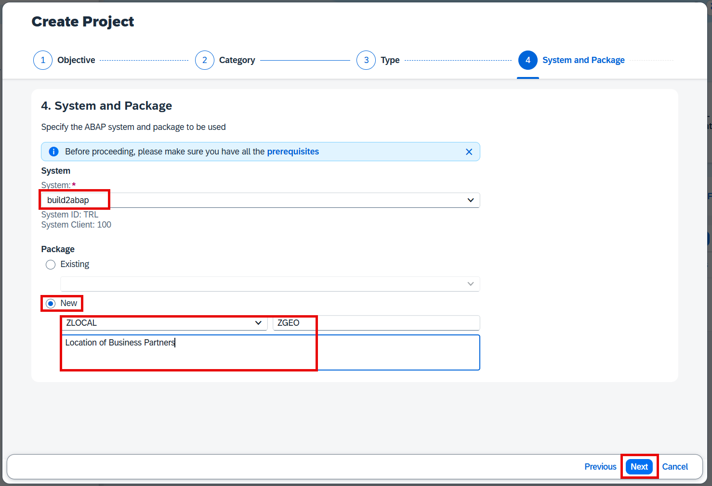

  7. If you are asked - create a new transport request with any description you want. Then choose **Next**.

  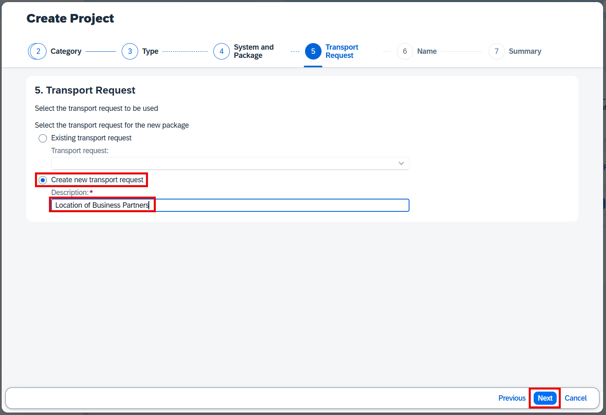

  8. Enter **zgeo** as the name of the project. Enter **GEO ABAP** in the **Description** field. Then choose **Review**.

  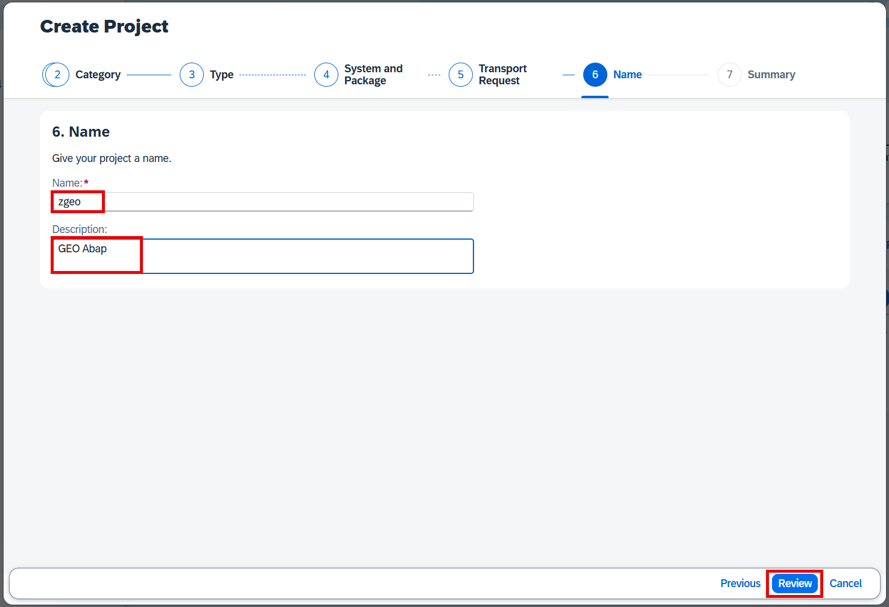

  9. Afterwards choose **Create**. You will have a popup asking you to open **SAP Development Tools for Eclipse**. Confirm it. Also confirm the next popup asking if it's allowed to handle the commands for Eclipse.

  10. A new ABAP Cloud Project will be created in the Eclipse IDE. Choose **Next** in the creation popup.

  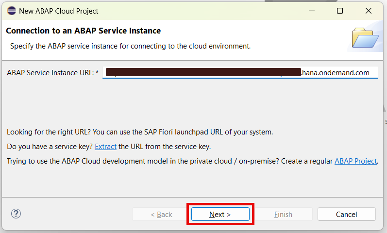

  11. Choose **Open Logon Page in Browser**. You will have an additional tab in your browser. Follow the instructions there to log in.

  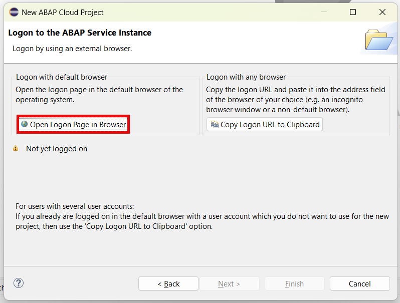

  12. Finally your Eclipse IDE will ask you for the name of the Cloud project. Enter **TRIAL_ENV** and then choose **Finish**.

  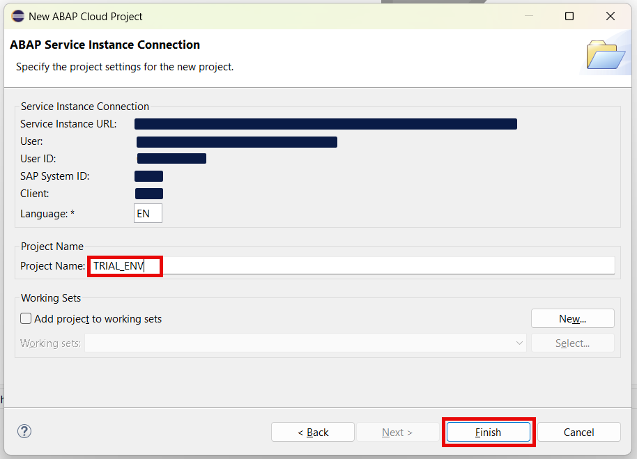

  13. Your new package **ZGEO** will be shown. 

  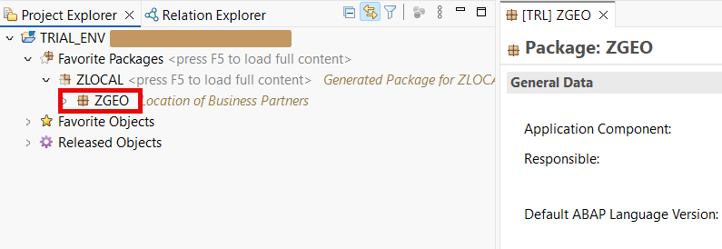

## Result

You have created a SAP Build project for ABAP. This enabled a new package to store all other artifacts. You can always open this package from SAP Build Lobby. Now you are ready to create data entities.

## Next Step

[Create Database Tables](../tables/README.md)

## Reference Links

- [ABAP Packages](https://help.sap.com/docs/ABAP_PLATFORM/c238d694b825421f940829321ffa326a/4ec14bab6e391014adc9fffe4e204223.html)

