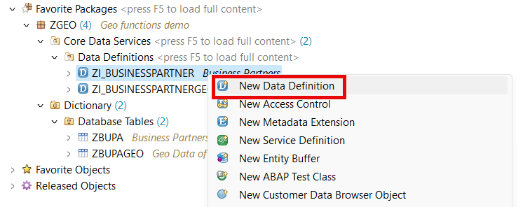
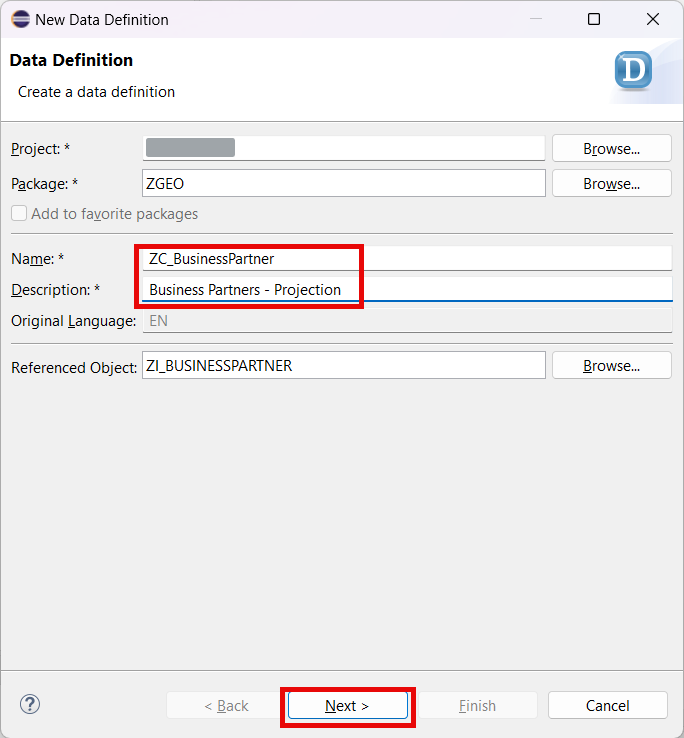
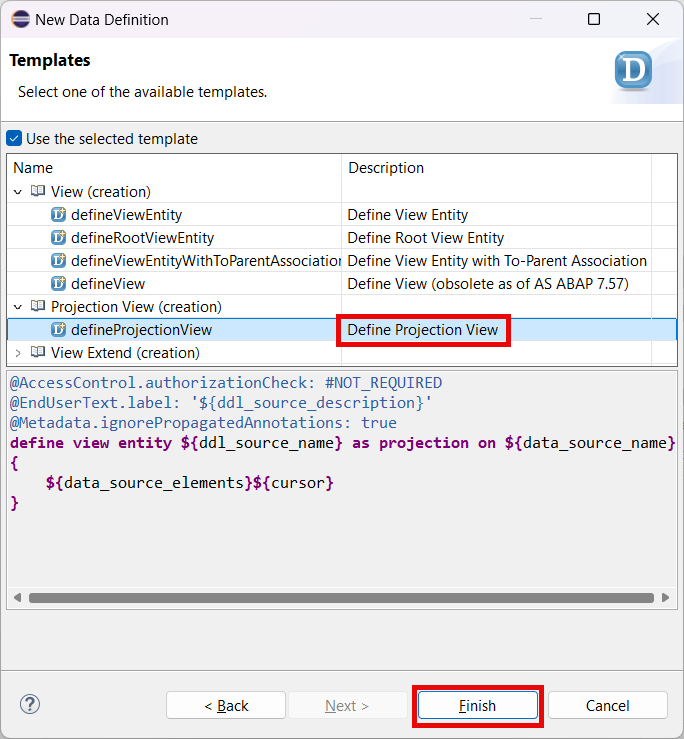
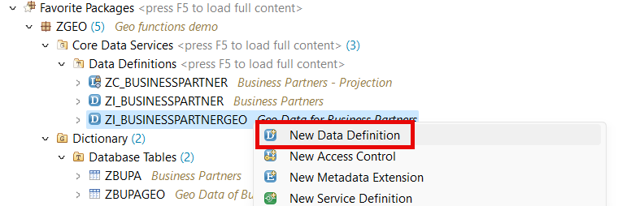
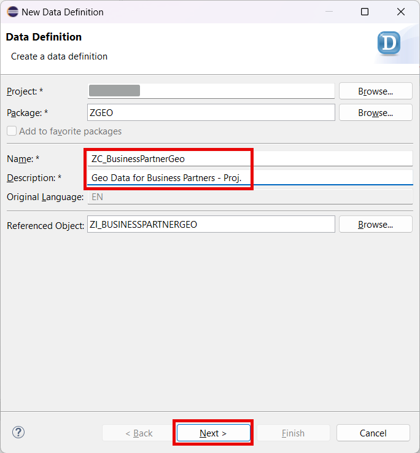
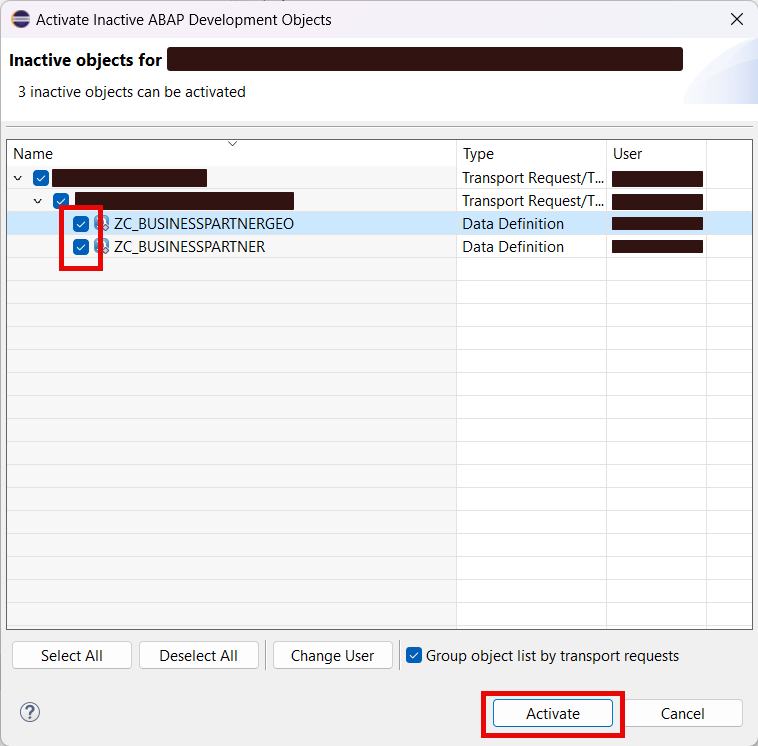

# Create Business Object Projections

## Introduction 

In this exercise, you will create a projection layer of your service. Projections enable flexible service consumption as well as role-based service designs. In our case we will hide the technical field with spatial data as its field type is not yet fully supported by the RAP BO Runtime.

If one BO entity is projected, the root and all parent entities must be projected as well. The root entity has to stay the root entity and must be defined as root projection view. The compositions are redirected to the new target projection entity.

## Content

### Task 1: Create projection for root view entity

1. Right click on the CDS View **ZI_BusinessPartner** created in the previous exercise.

2. Choose **New Data Definition** option in the context menu.

   

3. Enter the following data and then choose **Next**:
  - **ZC_BusinessPartner** in the **Name** field
  - **Business Partners - Projection** in the **Description** field

   

4. On the next screen select your transport and choose **Next**.

5. On the next screen select the **Define Projection View** template and then choose **Finish**.

   

6. Replace the code of the view with the one below:

~~~abap
@EndUserText.label: 'Business Partners - Projection'
@AccessControl.authorizationCheck: #NOT_REQUIRED
define root view entity ZC_BusinessPartner 
    provider contract transactional_query
    as projection on ZI_BusinessPartner
{
    key Partner,
    NameFirst,
    NameLast,
    /* Associations */
    _GeoData: redirected to composition child ZC_BusinessPartnerGeo
}
~~~

> Note that the code has errors. It is ok now, we have to create another view first.

> We had to define the type of our projection view. The type of projection view is specified using the syntax addition **PROVIDER CONTRACT**. CDS transactional queries are intended for modelling the projection layer of a RAP business object, that's why this type of contract was specified. It is not recommended, to define a CDS projection view without a provider contract.

7. Choose **Save** button.
   
  

### Task 2: Create projection for geo location view entity

1. Right click on the CDS View **ZI_BusinessPartnerGeo** created in the previous exercise.

2. Choose **New Data Definition** option in the context menu.

   

3. Enter the following data and then choose **Next**:
  - **ZC_BusinessPartnerGeo** in the **Name** field
  - **Geo Data for Business Partners - Proj.** in the **Description** field

   

4. On the next screen select your transport and choose **Next**.

5. On the next screen select the **Define Projection View** template and then choose **Finish**.

   

6. Replace the code of the view with the one below:

~~~abap
@EndUserText.label: 'Geo Data for Business Partners - Proj.'
@AccessControl.authorizationCheck: #NOT_REQUIRED
define view entity ZC_BusinessPartnerGeo as projection on ZI_BusinessPartnerGeo
{
    key Partner,
    Latitude,
    Longitude,
    
    _BusinessPartner: redirected to parent ZC_BusinessPartner
}
~~~

7. Choose **Save** button.
   
  

## Task 3: Activate the views

1. Select **Activate inactive ABAP development objects** button.

  

2. In the popup window choose both new CDS views and then choose **Activate** button.

  

## Result

You have created a projection layer of your service. The projection layer is the first layer in the development flow of the ABAP RESTful Programming Model that is service specific. So now you can proceed with the serice exposure.

[Next Tutorial: Expose an OData Service](../service/README.md)

## Further reading / Reference Links

- [Business Object Projection](https://help.sap.com/docs/abap-cloud/abap-rap/business-object-projection)
- [ABAP CDS - Projection Views](https://help.sap.com/doc/abapdocu_latest_index_htm/latest/en-US/index.htm?file=abencds_pv_no_contract.htm)

