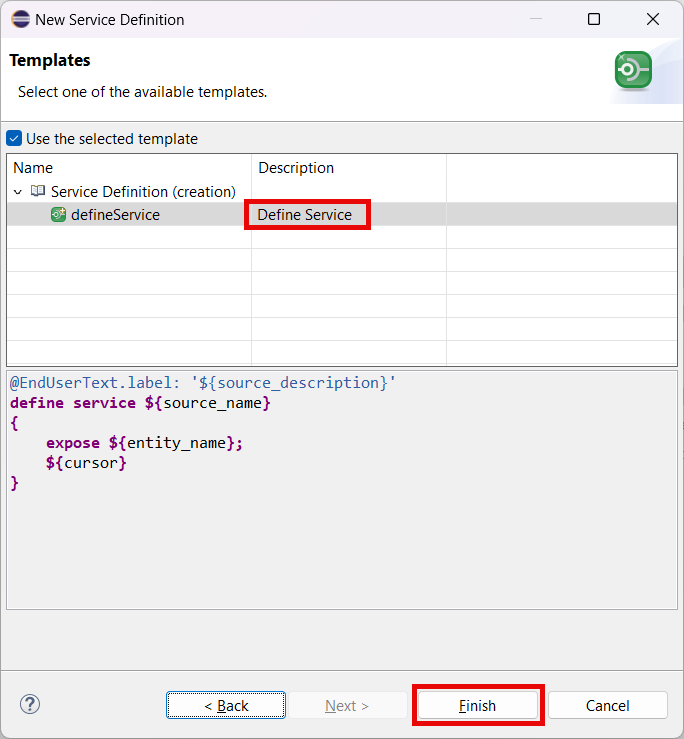

# Expose Service

## Introduction 

In this part, you will create objects needed to expose your data model as an OData service.

## 1. Create Service Definition

1. Right-click your root CDS view **ZC_BusinessPartner**.

2. Choose **New Service Definition** in the popup menu.

   

3. Enter the following details and choose **Next**:
  - **ZGEO** in the **Name** field
  - **Geo Service** in the **Description** field

  

4. Select your transport and then choose **Next**.

5. Choose the **Define Service** template and then choose **Finish**.

  

6. Replace the code of your service definition with the one shown below:

~~~abap
@EndUserText.label: 'Geo Service'
define service ZGEO {
  expose ZC_BusinessPartner    as BusinessPartner;
  expose ZC_BusinessPartnerGeo as BusinessPartnerGeo;
}
~~~

7. Choose **Activate**.

  

## 2. Create Service Binding

1. Right-click your new service definition **ZGEO**.

2. Choose **New Service Binding** in the popup menu.

   

3. Enter the following details and then choose **Next**:
  - **ZAPI_GEO_O2** in the **Name** field
  - **API Geo Service OData V2** in the **Description** field
  - **OData V2 - Web API** in the **Binding Type** list box

   

4. Select your transport and choose **Finish**.

5. Choose **Activate**.

  

6. After the service binding was activated, choose **Publish**.  

  

## Result

You have created a service definition and a service binding. Now your service is ready to be consumed. But before you will add some custom business logic.

## Next Step

[Add Geo Coordinates Logic](../geo-logic/README.md)

## Reference Links

- [Service Definition](https://help.sap.com/docs/ABAP_PLATFORM_NEW/fc4c71aa50014fd1b43721701471913d/b09e4d53bfca4544a9f8910bcc2cd9d6.html)
- [Service Binding](https://help.sap.com/docs/ABAP_PLATFORM_NEW/fc4c71aa50014fd1b43721701471913d/b58a3c27df4e406f9335d4b346f6be04.html)

