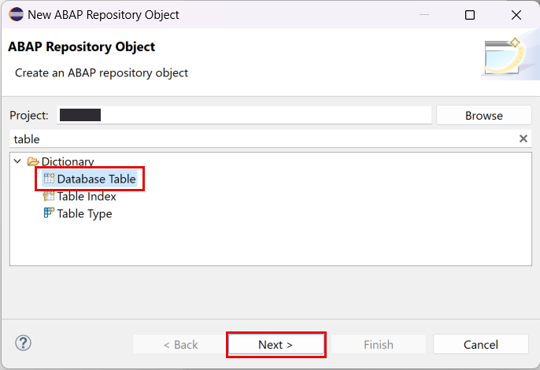
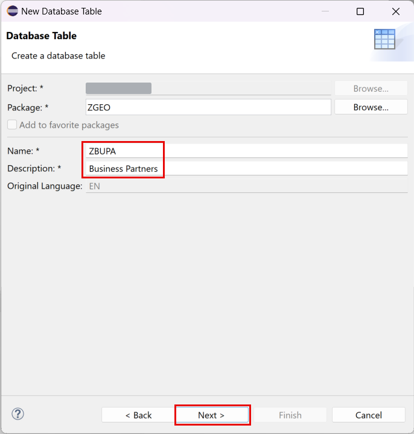

# Create Database Tables

## Introduction 

In this exercise, you will create 2 database tables which will represent the basis of the data model of your service.

We need 2 tables to split master data and transactional data. One table will be used for storing business partner general information. Another one will contain current position of the partner.

## Content

### Task 1: Create a table for Business Partners

1. Right click on your package name created in the previous exercise.

2. Choose **New** &rarr; **Other ABAP Repository Object** option in the context menu.

   

3. Choose **Database Tables** in the **Dictionary** folder and then choose **Next**.

   

4. Enter the following data and then choose **Next**:

  - **ZBUPA** in the **Name** field
  - **Business Partners** in the **Description** field

   

5. On the next screen select your transport (if applicable) and choose **Finish**.

6. Replace the code of the table with the one below

~~~abap
@EndUserText.label : 'Business Partners'
@AbapCatalog.enhancement.category : #NOT_EXTENSIBLE
@AbapCatalog.tableCategory : #TRANSPARENT
@AbapCatalog.deliveryClass : #A
@AbapCatalog.dataMaintenance : #RESTRICTED
define table zbupa {

  key client  : abap.clnt not null;
  key partner : abap.char(10) not null;
  name_first  : abap.char(40);
  name_last   : abap.char(40);

}
~~~

> For the simplicity reason we only have partner names in this table.

7. Choose **Activate** button.
   
  

### Task 2: Create a table for Business Partners Geo Data

1. Repeat all the steps from the previous task. But this time use the following table data:

  - **ZBUPAGEO** in the **Name** field
  - **Geo Data of Business Partners** in the **Description** field

2. Use the following code for the table:

~~~abap
@EndUserText.label : 'Geo Data of Business Partners'
@AbapCatalog.enhancement.category : #NOT_EXTENSIBLE
@AbapCatalog.tableCategory : #TRANSPARENT
@AbapCatalog.deliveryClass : #A
@AbapCatalog.dataMaintenance : #RESTRICTED
define table zbupageo {

  key client  : abap.clnt not null;
  key partner : abap.char(10) not null;
  latitude    : abap.dec(16,13);
  longitude   : abap.dec(16,13);
  @AbapCatalog.geo.spatialRefSystem : '4326'
  location    : abap.geom_ewkb;

}
~~~

> We use 2 ways of storing spatial data here - human readable geo coordinates and spatial type *abap.geom_ewkb*. On the one hand It's easier to deal with the pure coordinates during service requests. But on the other hand when we want to do some geo search in the database - we need to use HANA spatial engine. So both representations are necessary.

> The data type GEOM_EWKB requires a coordinate reference system (a Spatial Reference System), namely a defined space in which geometric positions are described. Every spatial reference system has a unique spatial reference identifier (or SRID). A common SRID in use is 4326, which represents spatial data using longitude and latitude coordinates on the Earth's surface as defined in the WGS84 standard, which is also used for the Global Positioning System (GPS).

3. Do not forget to activate the table.

## Result

You have created 2 database tables. The tables will be used as a basis of a new RAP Business Object.

[Next Tutorial: Create Business Object](../bo/README.md)

## Further reading / Reference Links

- [Create a Simple Database Table for ABAP Environment](https://developers.sap.com/tutorials/abap-environment-create-table.html)
- [Geodata Types](https://help.sap.com/doc/abapdocu_754_index_htm/7.54/en-US/abenddic_geo_data.htm)

