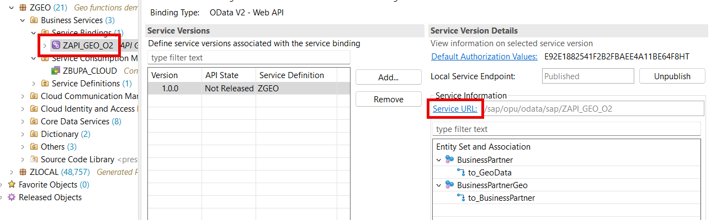
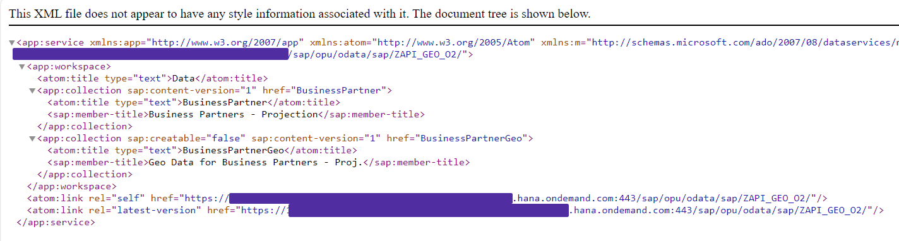
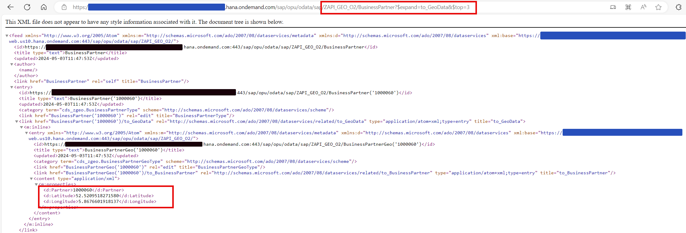
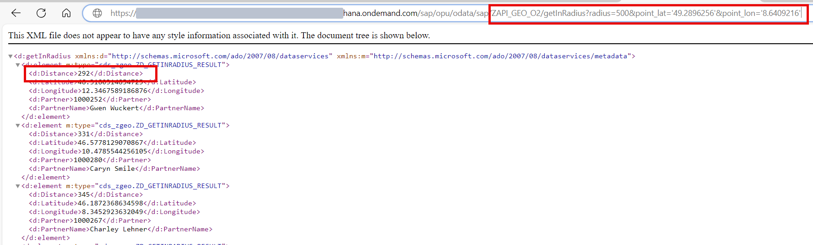

# Test the service

## Introduction 

In this exercise, you will test the RESTful ABAP service.

## Content

### Task 1: Test the service

1. Open your service binding **ZAPI_GEO_O2**

2. Select **Service URL** link to open the service API in browser.

  

3. Login when promted. You should see a service metadata in your new browser window.

  

4. Now change the URL by adding the following text right after the service ID **ZAPI_GEO_O2**. You should see 3 partners data including the geo coordinates.

~~~url
/BusinessPartner?$expand=to_GeoData&$top=3
~~~

   

5. Now change the URL by adding the following text right after the service ID **ZAPI_GEO_O2**. This will call **Get In Radius** function to show all the partners in radius 500 km around *Walldorf, Germany* (defined by geo coordinates). Make sure that your response is not empty and contains distance (in kilometers) for every found partner.

~~~url
/getInRadius?radius=500&point_lat='49.2896256'&point_lon='8.6409216'
~~~

  

## Result

You have tested your service and verified that it provides a partner list with expanded entities and can perform the function **Get In Radius**.

## Further reading / Reference Links

- [Automated Test](https://help.sap.com/docs/abap-cloud/abap-rap/test?version=s4hana_cloud)